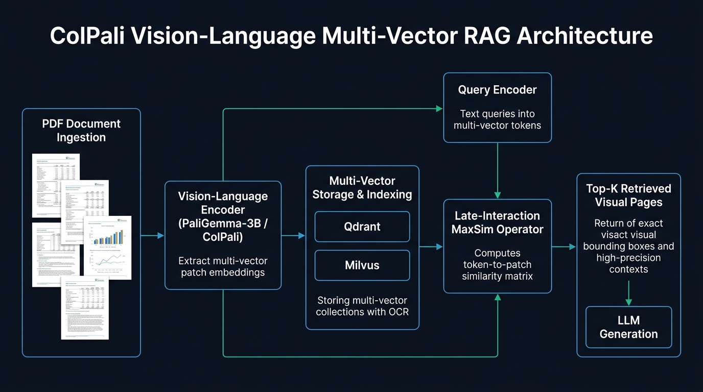

# 👁️ tp-colpali-rag: ColPali Vision-Language Multi-Vector RAG Studio

Production-ready implementation of **ColPali v1.2** (PaliGemma-3B backbone) for zero-OCR, multi-vector document retrieval in enterprise RAG systems.

🔗 **Interactive Studio:** [talaripradeep.info/tools/colpali-vlm-rag/](https://talaripradeep.info/tools/colpali-vlm-rag/)



## Core Capabilities

- **Zero OCR Pipelines**: Encodes raw PDF page screenshots directly into multi-vector patch embeddings (1024-dim, up to 1030 patch tokens per page).
- **Preserves Layout & Visual Tables**: Captures nested financial balance sheets, charts, typography hierarchy, and visual infographics that OCR breaks.
- **Late Interaction MaxSim**: Uses ColBERT-style MaxSim operator across query tokens and image patches for granular token-to-patch scoring.
- **Multi-Vector Vector Store Integration**: Native schema templates for **Qdrant** and **Milvus 2.4+** supporting binary and scalar int8 quantization.

## Quickstart

```bash
docker compose up -d qdrant
pip install torch colpali-engine qdrant-client pillow
python colpali_retriever.py
```

## Production Guardrails

1. **Quantization**: Enable `binary` quantization in Qdrant to achieve 32x memory compression with less than 2% drop in nDCG@10.
2. **GPU Sizing**: Minimum 16GB VRAM (NVIDIA L4, A10G, or A100) recommended for batch indexing at 448x448 resolution.
3. **Caching**: Store visual patch embeddings persistently to avoid re-encoding static documents.

## License

MIT © 2026 Talari Pradeep
